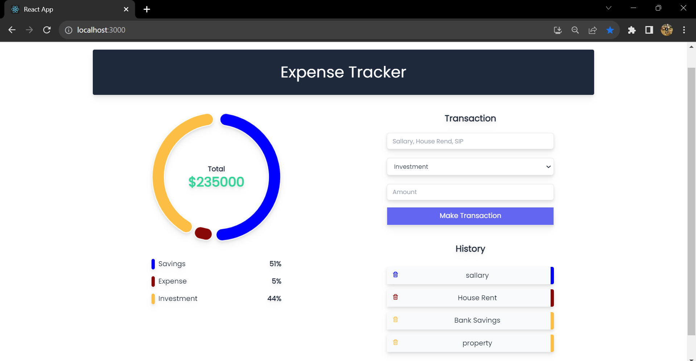

<h1> MERN Expense Trackerr </h1>

# About this application:

* The MERN Expense Tracker application will allow users to keep track of their day-to-day expenses.
*  Users will be able to add their expense records with details such as expense description, category, amount.
*  The application will store these expense records and extract meaningful data patterns to give the user a visual representation of how their expense habits fare as time progresses.
*  Users can also delete their past expenses.

- [x] Landing Page:

